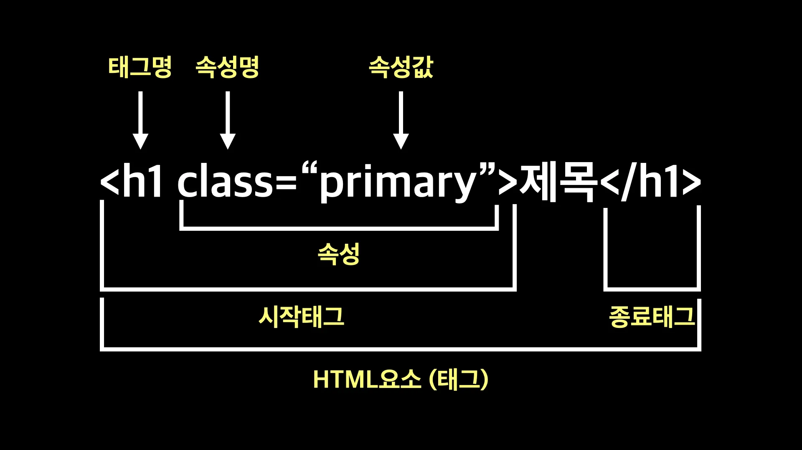

웹 사이트는 기본적으로 HTML, CSS, JavaScript를 사용한다.

- HTML : 웹 사이트를 정의
- CSS : 예쁘게 꾸미기
- JavaScript : 동작하기

<br/>

## HTML

Hyper Text Markup Language의 약자로 웹 페이지를 만드는 언어다.
여기서 Hyper의 사전적 의미는 "최고의", "과도한" 이라는 뜻으로, Hyper Text는 기존의 일반적인 문서보다 <b>월등한 최고의 기능을 담고 있는 문서</b> 라고 보면 된다.

그 기능 중에 대표적인 기능이 바로 Hyper Link라는 기능이다. 이 기능은 텍스트를 클릭하면 링크된 다른 웹 문서로 이동하는 문서연결 기능이다.

그리고 Markup은 원래 인쇄할 때 원고에서 교정표시를 나타내는 뜻으로, 말 그대로 Mark 하는 것을 말한다. 웹 문서에서는 <b>특정 텍스트에 Mark 하기 위하여 <u>HTML 태그</u></b>라는 것을 사용한다.

```html
<h1>제목</h1>
<p>내용이 들어오는 자리</p>
<a href="http://www.naver.com">네이버로 이동</a>
```

예시처럼 제목과 같이 크게 볼 수 있도록 하려면 `<h1>` 태그를 사용한다. 내용과 같은 글의 문단을 표시하려면 `<p>` 태그를 사용한다. 다른 웹 문서로 이동하기 위하여 `<a>` 태그를 사용한다.

HTML 태그를 사용 함으로써 원하는 정보를 효과적으로 표시 할 수 있다. 즉 Mark 한다고 말할 수 있다.

다시 말해서, HTML은 태그로 이루어진 Markup 언어라고 보면 쉽다.

현재 HTML은 5까지 발표되어있으며, 단순히 웹 문서만을 표현하는게 아니라 게임, 채팅과 같은 웹 애플리케이션을 만들 수 있는 다양한 기능을 갖고 있다.

<br/>

## HTML 태그

웹 문서에 어떤 표시를 해주는 것.
예를 들면 글자 크기, 글자색, 글자 모양 등을 변경하거나 하이퍼 링크와 같은 문서연결 기능을 넣을 때 사용한다.

### 1. 태그구조



- 태그는 Element, 즉 요소 또는 노드라고도 부른다.
- 태그 = 요소(Element) = 노드(Node)

<br/>

## HTML 문서구조

```html
<!DOCTYPE html>
<html lang="ko">
  <head>
    <meta charset="UTF-8" />
    <title>문서 제목</title>
  </head>
  <body>
    <h1>오늘의 TIL</h1>
    <p>맨날 까먹는다 공부하자</p>
  </body>
</html>
```

- `<!DOCTYPE html>` : 도큐먼트 타입으로 현재 문서가 어떤 버전으로 작성되었는지 미리 표시한다. `<!DOCTYPE>`은 태그가 아니며 웹 문서 제일 처음에 표시된다. 위 예시의 도큐먼트 타입은 HTML5버전 이라는 뜻이다. 대부분 HTML5 버전을 사용하고 있기 때문에 웹 사이트를 만들 때 제일 상단에 `<!DOCTYPE html>` 표시를 사용하면 된다.
- `<html lang="ko"> ~ </html>` : 웹 문서의 시작과 끝을 나타내는 태그이다.
  - lang="ko" - lang 속성은 웹 문서가 어떠한 언어로 작성되었는지 표시하는 속성이며, 이러한 속성은 웹 접근성 향상에 도움을 준다.
- `<head>~</head>` : html 태그의 자식 태그로, HTML 문서 정보나 문서에서 사용할 외부 파일 링크를 넣는 구간이다. <b>웹 브라우저에는 표시되지 않는다.</b>
  - `<meta charset="UTF-8">`
    HTML 파일의 인코딩을 알려주는 태그. 브라우저에게 이 문서를 어떻게 그리는지 알려준다. 이 태그를 입력 해야지 한글, 특수문자 들이 깨지지 않고 출력된다.
- `<body>~<body>` : html 태그의 자식 태그로, HTMl 문서 내용을 넣는 구간이다. 실제 웹 브라우저 안에 표시된다. 이 태그 안에 실제 문서 내용을 입력하여 웹 사이트를 만든다.
