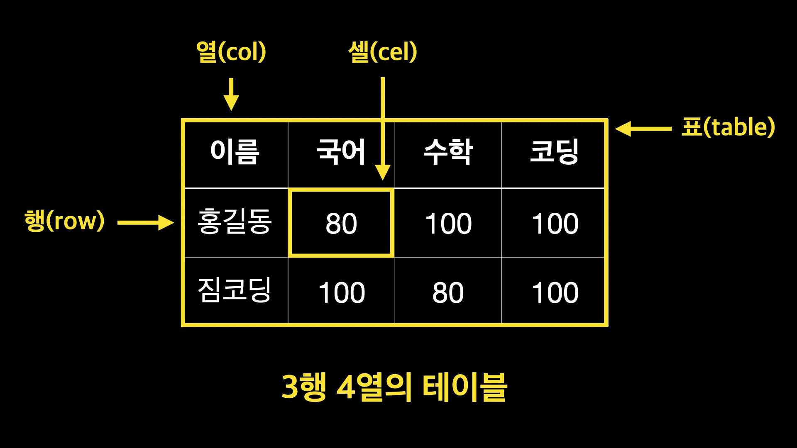

## 글꼴

- `<h1> ~ <h6>`
  - Heading
  - 웹 페이지의 제목 또는 부제목을 표현 할 때 사용하며, 숫자가 작을수록 큰 제목을 표시
- `<p>`
  - Paragraph
  - 하나의 문단을 표시할 때 사용
- `<hr>`
  - Horizontal Rule
  - 가로로 선을 긋는 태그
- `<br>`
  - Break
  - 줄바꿈 태그로 HTML에서 개행 역할
- `<i>`
  - Italic
  - 텍스트를 이탤릭체로 표시할 때 사용
- `<em>`
  - Emphasis
  - 텍스트를 이탤릭체로 <b>강조</b> 할 때 사용
- `<b>`
  - Bold
  - 텍스트를 진하게 표시할 때 사용
- `<strong>`
  - 텍스트를 진하게 강조할 때 사용

<br/>

> `<b> vs <strong> 차이`, `<i> vs <em> 차이`
>
> b 태그와 strong 태그 모두 진하게 표시할 때 사용하고, i 태그와 em 태그도 모두 이탤릭체로 표시할 때 사용한다.
> 하지만 두 태그의 사용 용도는 크게 다르다.
>
> - b 태그와 i 태그는 단순히 텍스트를 진하게 그리고 이탤릭체로 표시하는 역할만 한다.
>
> - strong 태그와 em 태그는 실제로 페이지 내의 중요한 부분으로 강조하고 싶을 때 사용한다.
>
> - strong 태그와 em 태그는 웹 접근성에 큰 기여를 한다. <b>스크린 리더를 사용 할 경우 strong 태그에 대한 거센 억양으로 음을 낼 수 있도록</b> 하여 실제로 말할 때 강조 하듯 들리게 재구성 할 수 있게 된다.

<br/>

## 목록

- `<ol>`
  - Ordered List
  - 순서가 있는 목록
  - type 속성으로 글머리 기호를 변경 할 수 있다.
- `<ul>`
  - Unordered Lists
  - 순서가 없는 목록
- `<li>`
  - Listed item
  - 목록 하위 항목
  - `<ul>`, `<ol>` 태그의 하위에 위치
- `<dl>`
  - Definition List
  - 정의 목록의 약자.
  - 사전처럼 용어를 설명하는 목록
  - 예) A는 B다. key = value
- `<dt>`
  - Definition Term
  - 정의되는 용어의 제목
- `<dd>`
  - Definition Description
  - 용어를 설명

1. dl 태그는 하나 이상의 dt-dd 쌍의 태그를 갖고 있어야한다.

2. 단, dt-dd 태그가 반드시 하나의 짝으로 지어져야 하는 것은 아니다.

```html
<dl>
  <dt>타이틀</dt>
  <dd>내용</dd>
  <dd>내용2</dd>
</dl>

<dl>
  <dt>타이틀1</dt>
  <dt>타이틀2</dt>
  <dd>내용</dd>
</dl>
```

3. li, dt-dd 태그는 밖에서 독립적으로 사용 할 수 없다.

4. ul 태그 하위요소로는 li 태그가 위치해야 한다.

<br/>

## Table



<br/>

- `<table>` - 표
- `<tr>` - 행
- `<td>` - 열

<br/>

### 테이블 기본 태그

- `<colgroup>`
  - 열을 그룹으로 묶을 수 있도록 해주는 태그이다.
- `<col>`
  - `<colgroup>` 태그의 자식으로 열 단위를 나눌 수 있다
  - `<span>` 속성을 사용하여 열을 그룹으로 묶을지 설정한다.
  - 예) `<col span="3">` → 세 개의 열을 그룹으로 묶음
- `<thead>`
  - 표의 제목 열들을 묶는 그룹 태그
- `<tbody>`
  - 표의 일반적인 데이터들을 묶는 그룹 태그
  - 기본적으로 행그룹태그를 사용하지 않으면 크롬브라우저가 자동으로 tbody 태그로 묶어준다.
- `<tfoot>`
  - 표의 하단 영역을 묶는 그룹태그

<br/>

### 테이블 관련 태그

- `<table>`
  - 표를 만드는 태그로써, 표 전체를 감싸는데 사용한다.
- `<caption>`
  - 표의 제목이나 설명을 작성하는 태그
- `<tr>`
  - 표의 행을 의미하는 태그. 자식으로 `<th>` , `<td>` 태그가 반드시 있어야 한다.
- `<th>`
  - 표의 제목 열을 의미하는 태그.
  - 부모 태그 안에 있어야 한다.
- `<td>`
  - 표의 일반 열을 의미하는 태그.
  - 부모 태그 안에 있어야 한다.

<br/>

### 테이블 관련 속성

- `<th>` 태그 속성
  - scope - 웹접근성 관련 속성으로 스크린리더가 데이터를 인식하고 읽는 순서를 결정짓게 한다.
    - th가 열에 쓰일경우 값을 "col"로 설정. 예) `<th scope="col">`
    - th가 행에 쓰일경우 값은 "row"로 설정. 예) `<th scope="row">`
- `<th>`, `<td>`
  - colspan - 열을 병합하는 속성.
    - 예) `<td colspan="2">`
  - rowspan - 행을 병합하는 속성.
    - 예) `<td rowspan="2">`
- `<col>`
  - width - 열의 가로너비를 지정하지만 `웹표준X` → CSS로 대체
  - span - 열을 그룹화 함.
    - 예) `<col span="3">` → 세 개의 열을 묶음.
